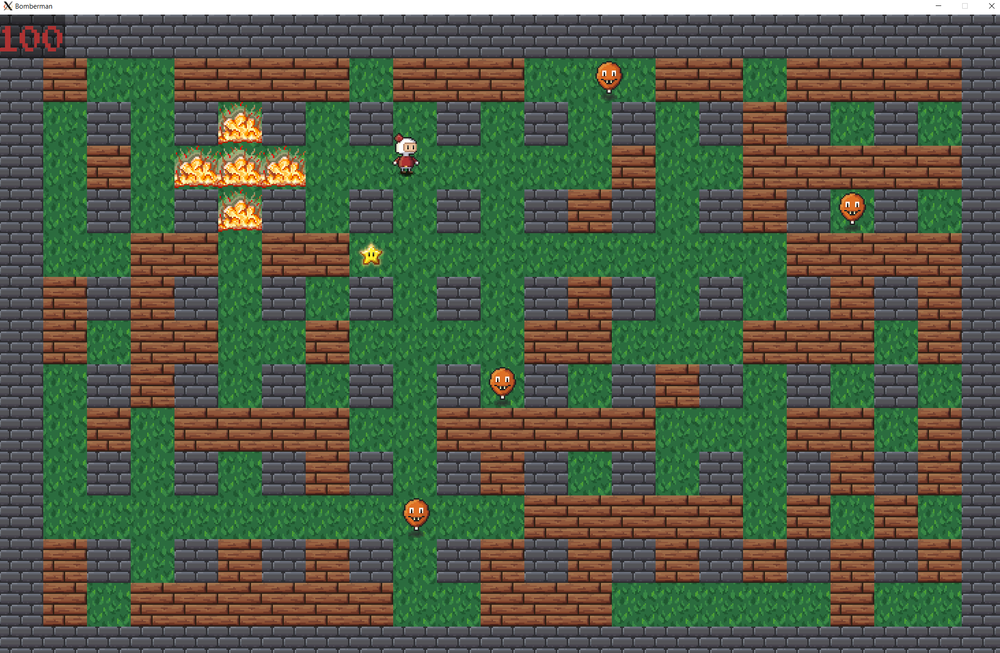
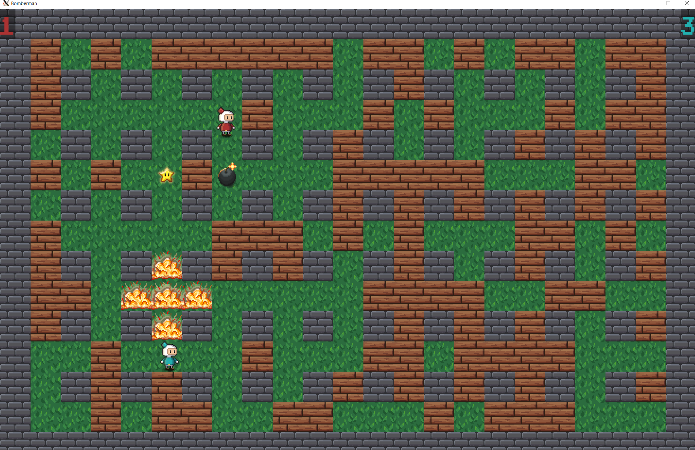
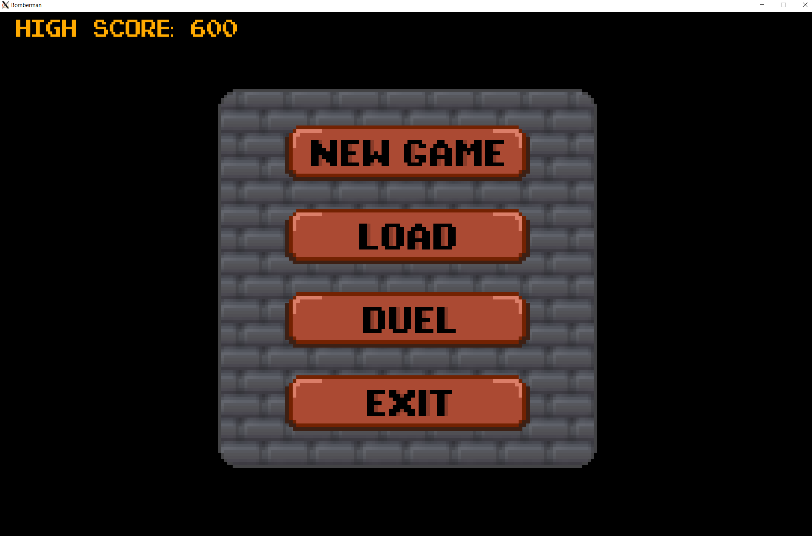

# About the game

## Gameplay

Player controls the bomberman character using controls. They place bombs to destroy wooden walls and enemies. The player has
only one life per game, but in return they get unlimited number of bombs. Only one bomb can be placed per key press though.
A destroyed wooden wall can sometimes drop a bonus, whose effect will last for the rest of the game level. The same bonuses
cannot stack on each other. There are only two types of bonuses: **mega bombs** and **speed up**.

### The game offers two game modes:

1. **Singleplayer**
    - A game against the computer
    - The player has to kill spawned enemies, they cannot place bombs, but they will kill the player on touch
    - After killing all enemies a door to another level will appear
    - This game mode cannot be 'won', instead the player is trying to achieve overcome themselves using the score number
    - Score points can be gained by killing enemies, the game will keep the high score troughout game launches

2. **Duel**
    - A game against a local player
    - The players have to go through a couple of randomly generated levels and attack each other
    - Score points can only be gained by killing the other player, killing themselves counts as point for the other player
    - A winner is the player, who has gained more points

## Working with files

The game in a singleplayer mode can be saven at any given point into a file by pressing F5. Only one save file can exist,
meaning that a new save file will rewrite the old one. The map as well as the current score will be saven into a simple
format of a .txt file.

A simple format of a configuration file was implemented for the game. It must contain these items:
- **High score**
- **Save file** *a path to where the map will save or load from*
- **Enemies** *the number generated into the map*
- **Breakables** *the number generated into the map*
- **Duel rounds** *number of levels in duel mode*
- **Bonus chance** *percentual chance of its drop from destroyed blocks*
- **Bonus mega bombs** *additional blocks that will explode*
- **Bonus speed** *additional speed*

In case the configuration file is corrupted or contains invalid values, the game will not start.

## User interface

When the player starts the game, they will be met with a main menu. The menu displays the current high score (in singleplayer mode),
and a couple of clickable buttons:
- **New game** - starts a singleplayer randomly ganerated game
- **Load** - loads a game from a save file, if the file was corrupted, it will write an error message into the terminal and won't load
- **Duel** - starts a duel between two local players
- **Exit** - exits the game (as well as clicking the X button in the corner of the game window)

The menu can be called at any point of the game by pressing ESC. It will discard the current game and won't count the score into
the high score though.

## Controls

W, A, S, D - movement of the red player

SPACE - bomb placing of the red player

UP, DOWN, LEFT, RIGHT arrows - movement of the blue player

RIGHT CTRL - bomb placing of the blue player

F5 - saves the game in the singleplayer mode

ESC - returns to the main menu, discards the current game

## Prerequisites

For the game to function properly you need to install these packages:
- libsdl2-2.0
- libsdl2-dev
- libsdl2-gfx-dev
- libsdl2-image-dev
- libsdl2-ttf-dev
- libsdl2-mixer-dev

## Ownership

The game was implemented by myself only, I also drew every image in the game.

#### Quotations of the files I do not own:

**assets/linux_sdl_gl.sup**  
*A file of valgrind suppressions to supress SDL2 built in errors*

GRANDISON, Alrick. ValgrindSuppression. GitHub [online]. 2019 [quoted 2022-05-08].
Available from: https://github.com/Rickodesea/ValgrindSuppression/blob/master/linux_sdl_gl.sup

**assets/PixelEmulator.ttf**  
*A true type font used in the game*

All-free-download.com: Pixel Emulator [online]. [quoted 2022-05-21].
Available from: https://all-free-download.com/font/download/pixel_emulator_6914050.html